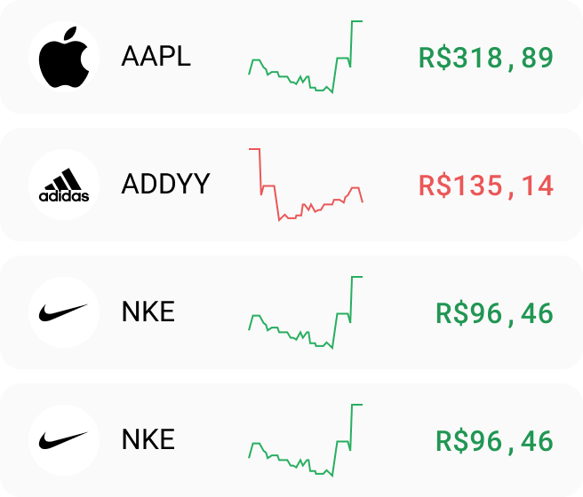
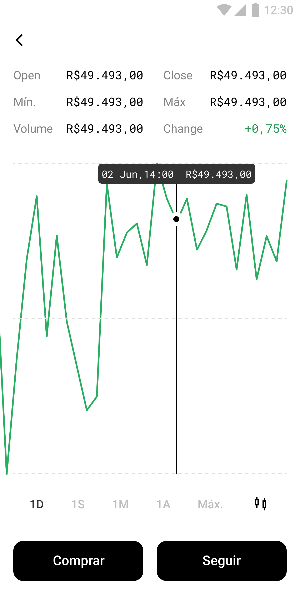
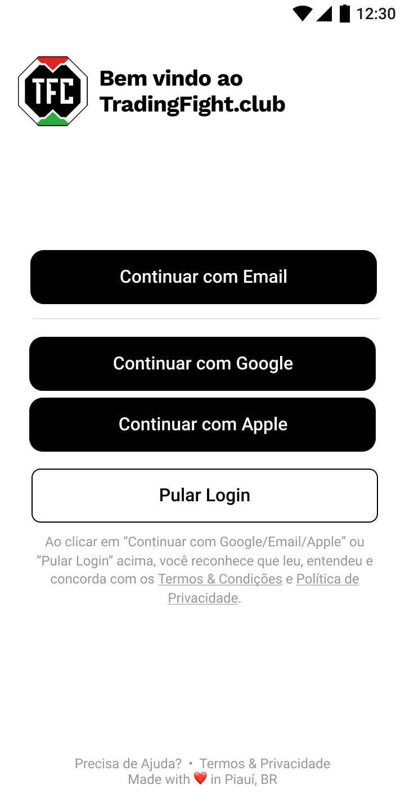

# tfc-functions

https://www.figma.com/file/SnTLRGwxp7TDCpRX8hPHos/MVP-Feats?node-id=111%3A576

## TODOs
- [ ] Exchanges
- [ ] Companies info
- [ ] 1D rage of 15min candles (OHLC)
- [ ] 1S range of 15min candles (OHLC)
- [ ] 6M of 1day candles (OHLC)
- [ ] 1day candles since 01/2019 (OHLC)
- [ ] New account
- [ ] Buy Order
- [ ] Sell Order
- [ ] Users portfolio consolidation
---
## Companies Info


```JSON
{
  "symbol": "AAPL",
  "name": "Apple Inc",
  "exchange": "NASDAQ",
  "sector": "Technology",
  "industry": "Consumer Electronics",
  "employees": 154000,
  "website": "http://www.apple.com",
  "description": "Apple Inc. designs, manufactures, and markets smartphones, personal computers, tablets, wearables, and accessories worldwide. It also sells various related services. In addition, the company offers iPhone, a line of smartphones; Mac, a line of personal computers; iPad, a line of multi-purpose tablets; AirPods Max, an over-ear wireless headphone; and wearables, home, and accessories comprising AirPods, Apple TV, Apple Watch, Beats products, HomePod, and iPod touch. Further, it provides AppleCare support services; cloud services store services; and operates various platforms, including the App Store that allow customers to discover and download applications and digital content, such as books, music, video, games, and podcasts. Additionally, the company offers various services, such as Apple Arcade, a game subscription service; Apple Music, which offers users a curated listening experience with on-demand radio stations; Apple News+, a subscription news and magazine service; Apple TV+, which offers exclusive original content; Apple Card, a co-branded credit card; and Apple Pay, a cashless payment service, as well as licenses its intellectual property. The company serves consumers, and small and mid-sized businesses; and the education, enterprise, and government markets. It distributes third-party applications for its products through the App Store. The company also sells its products through its retail and online stores, and direct sales force; and third-party cellular network carriers, wholesalers, retailers, and resellers. Apple Inc. was incorporated in 1977 and is headquartered in Cupertino, California.",
  "type": "Common Stock",
  "logo": "tradingfight.com/aapl.jpg",
  "CEO": "Mr. Timothy D. Cook",
  "address": "One Apple Park Way",
  "city": "Cupertino",
  "zip": "95014",
  "state": "CA",
  "country": "US",
  "phone": "408 996 1010",
  "price": 148,
  "price_flutuation": 0.75,
  "price_absolute_flutuation": 1,
  "week": [
  // EOD 1Week
  ]
}
```
- **cloud function:** stock-eod
- **description:** Get updated info about companies; Add new stocks; Compile EOD infos; get historical data for new ticker; 
- **trigger:** Cronjob Scheduler. 0 19 * * *
- **database:** Firestore
- **path:** companies/_exchange_ticker_ | exp: companies/nasdaq_aapl

## Intraday values


```JSON
{
  "NASDAQ_AAPL": {
    "1D": [ // Dados de 15min apenas das últimas 24h
      {
        "datetime": "2021-09-16 15:59:00",
        "open": "148.73500",
        "high": "148.86000",
        "low": "148.73000",
        "close": "148.85001",
        "volume": "624277"
      }
    ],
    "1S": [ // Dados de 15min dos últimos 8 dias
      ...
    ],
    "6M": [ // Dados de 1day dos ultimos 6 meses
      ...
    ],
    "MAX": [ // Dados de 1day a partir jan de 2019
      ...
    ]
  }
}
```
- **cloud function:** intraday
- **description:** Fetch intraday values;
- **trigger:** Cronjob Scheduler. 15 9-18 * * 1-5
- **database:** Realtime
- **path:** _exchange_ticker_ | exp: nasdaq_aapl

## New Account


```JSON
{
  "name": "Victor Hugo",
  "avatar": "url",
  "net": 1000.00,
  "portfolio_value": 30000.00,
  "last_consolidation": "19-11-2021"
}
```
- **cloud function:** new-account
- **description:** Initialize user document;
- **trigger:** After a signup;
- **database:** Firestore
- **path:** users